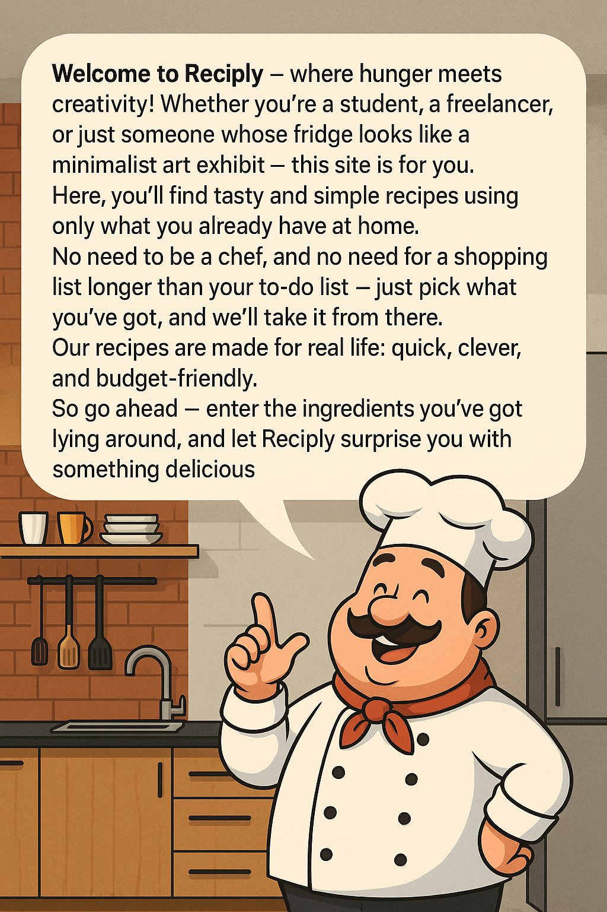

# 🍳 AI Recipe Generator

<div align="center">


**An intelligent recipe generation platform powered by AI**

[](https://reactjs.org/)
[](https://spring.io/projects/spring-boot)
[](https://www.typescriptlang.org/)
[](https://openjdk.org/)
[](LICENSE)

[Demo](#demo) • [Features](#features) • [Installation](#installation) • [Usage](#usage) • [API](#api) • [Contributing](#contributing)

</div>

---

## 📖 About

The **AI Recipe Generator** is a full-stack web application that creates personalized recipes based on your available ingredients, dietary preferences, and cooking constraints. Using advanced AI technology, it generates detailed recipes with step-by-step instructions, nutritional information, and beautiful presentations.

### 🎯 Key Highlights

- **AI-Powered**: Intelligent recipe generation based on your ingredients and preferences
- **Multilingual Support**: Available in English and Hebrew with RTL support
- **Modern UI**: Beautiful, responsive design with dark/light theme support
- **Recipe Management**: Save, view, and manage your generated recipes
- **Ingredient Categorization**: Organized ingredient selection by categories
- **Difficulty Levels**: Recipes tailored to your cooking skill level
- **Time Constraints**: Generate recipes based on available cooking time

---

## ✨ Features

### 🥘 Recipe Generation
- **Smart Ingredient Matching**: Select from categorized ingredients (proteins, carbohydrates, fats, vegetables, etc.)
- **Difficulty Levels**: Choose from beginner to expert cooking levels
- **Time-Based Filtering**: Generate recipes based on available cooking time
- **Dietary Preferences**: Customize recipes for various dietary needs

### 🌐 User Experience
- **Internationalization**: Full support for English and Hebrew languages
- **Responsive Design**: Optimized for desktop, tablet, and mobile devices
- **Theme Support**: Dark and light mode toggle
- **Progressive Web App**: Modern web app with offline capabilities
- **Intuitive Navigation**: User-friendly interface with smooth transitions

### 📱 Recipe Management
- **Recipe History**: Browse and revisit previously generated recipes
- **Detailed View**: Comprehensive recipe display with ingredients and instructions
- **Image Generation**: AI-generated recipe images for visual appeal
- **Export Options**: Save and share your favorite recipes

---

## 🏗️ Technology Stack

### Frontend
- **Framework**: React 19.0.0 with TypeScript
- **Styling**: Bootstrap 5.3.5 + Custom CSS
- **State Management**: React Context API
- **Routing**: React Router DOM 7.5.0
- **Internationalization**: i18next
- **Animations**: Framer Motion
- **Icons**: React Icons + Lucide React
- **HTTP Client**: Axios
- **Build Tool**: Vite

### Backend
- **Framework**: Spring Boot 3.4.2
- **Java Version**: OpenJDK 21
- **Web Layer**: Spring Web MVC
- **Validation**: Spring Boot Validation
- **Rate Limiting**: Bucket4j
- **HTTP Client**: Spring WebFlux WebClient
- **Build Tool**: Maven
- **Additional**: Lombok for code generation

---

## 🚀 Installation

### Prerequisites
- **Node.js** 18.0.0 or higher
- **Java JDK** 21 or higher
- **Maven** 3.6.0 or higher
- **Git**

### Clone Repository
```bash
git clone https://github.com/yourusername/Recipe_Project.git
cd Recipe_Project
```

### Backend Setup
```bash
# Navigate to backend directory
cd bakcend

# Install dependencies and build
./mvnw clean install

# Run the Spring Boot application
./mvnw spring-boot:run
```

The backend server will start on `http://localhost:8080`

### Frontend Setup
```bash
# Navigate to frontend directory
cd frontend

# Install dependencies
npm install

# Start development server
npm run dev
```

The frontend application will start on `http://localhost:5173`

---

## 📋 Usage

### 1. **Home Page**
- Welcome screen with language selection
- Quick access to recipe generation wizard
- Navigation to recipe history

### 2. **Recipe Generation Wizard**
- **Step 1**: Select cooking difficulty level
- **Step 2**: Choose available cooking time
- **Step 3**: Select ingredients by category
- **Step 4**: Generate and view your personalized recipe

### 3. **Recipe Management**
- View generated recipe with detailed instructions
- Browse recipe history
- Manage saved recipes

### 4. **Settings**
- Toggle between light and dark themes
- Switch between English and Hebrew languages
- Customize user preferences

---

## 🔌 API Documentation

### Base URL
```
http://localhost:8080/api
```

### Endpoints

#### Generate Recipe
```http
POST /generate-recipe
Content-Type: application/json

{
  "difficulty": "medium",
  "timeRange": "30-60 minutes",
  "ingredients": {
    "protein": ["chicken", "eggs"],
    "carbohydrates": ["rice", "pasta"],
    "vegetables": ["tomatoes", "onions"],
    // ... other categories
  },
  "language": "en"
}
```

**Response:**
```json
{
  "id": "recipe-123",
  "title": "Chicken Fried Rice",
  "description": "A delicious and easy chicken fried rice...",
  "ingredients": [
    {
      "name": "Chicken breast",
      "amount": "200",
      "unit": "grams"
    }
  ],
  "steps": [
    "Heat oil in a large pan...",
    "Add chicken and cook until..."
  ],
  "preparationTime": "45 minutes",
  "difficulty": "medium",
  "imageUrl": "https://example.com/recipe-image.jpg",
  "tags": ["quick", "protein-rich", "asian"]
}
```

---

## 🏃‍♂️ Development

### Frontend Development
```bash
cd frontend

# Start development server with hot reload
npm run dev

# Build for production
npm run build

# Preview production build
npm run preview

# Run linting
npm run lint
```

### Backend Development
```bash
cd bakcend

# Run in development mode
./mvnw spring-boot:run

# Run tests
./mvnw test

# Package application
./mvnw package
```

### Project Structure
```
Recipe_Project/
├── frontend/                 # React TypeScript frontend
│   ├── src/
│   │   ├── Components/      # React components
│   │   ├── Context/         # React context providers
│   │   ├── Service/         # API service layer
│   │   └── assets/          # Static assets
│   ├── public/              # Public assets
│   └── package.json
├── bakcend/                 # Spring Boot backend
│   ├── src/
│   │   ├── main/java/       # Java source code
│   │   └── main/resources/  # Configuration files
│   └── pom.xml
└── README.md
```

---

## 🎨 Screenshots

<div align="center">

### Home Page


### Recipe Generation Wizard
*Beautiful ingredient selection interface with categorized options*

### Generated Recipe
*Detailed recipe view with ingredients, instructions, and generated images*

</div>

---

## 🤝 Contributing

We welcome contributions to the AI Recipe Generator! Here's how you can help:

### Getting Started
1. Fork the repository
2. Create a feature branch (`git checkout -b feature/amazing-feature`)
3. Commit your changes (`git commit -m 'Add some amazing feature'`)
4. Push to the branch (`git push origin feature/amazing-feature`)
5. Open a Pull Request

### Development Guidelines
- Follow the existing code style and conventions
- Write meaningful commit messages
- Add tests for new features
- Update documentation as needed
- Ensure all tests pass before submitting

### Areas for Contribution
- 🌐 Additional language support
- 🎨 UI/UX improvements
- 🔧 Performance optimizations
- 📱 Mobile app development
- 🧪 Test coverage improvements
- 📚 Documentation enhancements

---

## 📄 License

This project is licensed under the MIT License - see the [LICENSE](LICENSE) file for details.

---

## 🙏 Acknowledgments

- **OpenAI** for AI-powered recipe generation capabilities
- **React Community** for the amazing ecosystem
- **Spring Boot Team** for the robust backend framework
- **Bootstrap** for the responsive UI components
- **Unsplash** for beautiful food photography

---

## 📞 Support

- 📧 **Email**: [your-email@example.com](mailto:your-email@example.com)
- 🐛 **Issues**: [GitHub Issues](https://github.com/yourusername/Recipe_Project/issues)
- 💬 **Discussions**: [GitHub Discussions](https://github.com/yourusername/Recipe_Project/discussions)

---

<div align="center">

**Made with ❤️ and 🍳 for food lovers everywhere**

[](https://github.com/yourusername/Recipe_Project)
[](https://github.com/yourusername/Recipe_Project/fork)

</div>